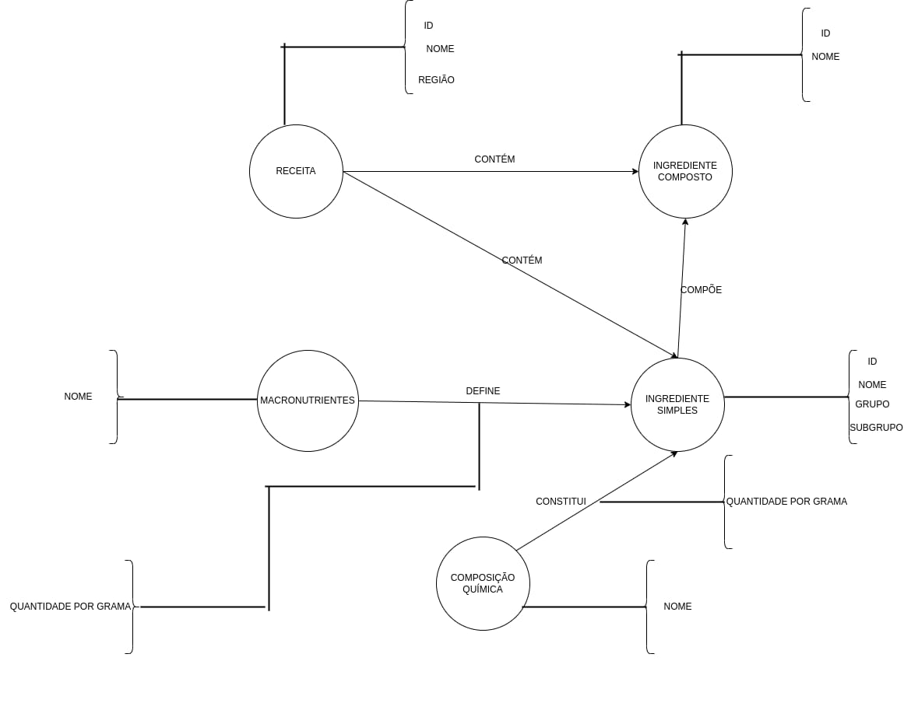

# Modelo de Apresentação da Final

# Estrutura de Arquivos e Pastas

A estrutura aqui apresentada é uma simplificação daquela proposta pelo [Cookiecutter Data Science](https://drivendata.github.io/cookiecutter-data-science/). Também será aceito que o projeto adote a estrutura completa do Cookiecutter Data Science e isso será considerado um diferencial. A estrutura geral é a seguinte e será detalhada a seguir:

~~~
├── README.md  <- arquivo apresentando a proposta
│
├── data
│   ├── external       <- dados de terceiros em formato usado para entrada na transformação
│   ├── interim        <- dados intermediários, e.g., resultado de transformação
│   ├── processed      <- dados finais usados para a publicação
│   └── raw            <- dados originais sem modificações
│
├── notebooks          <- Jupyter notebooks ou equivalentes
│
├── slides             <- arquivo de slides em formato PDF
│
├── src                <- fonte em linguagem de programação ou sistema (e.g., Orange, Cytoscape)
│   └── README.md      <- instruções básicas de instalação/execução
│
└── assets             <- mídias usadas no projeto
~~~

Na raiz deve haver um arquivo de nome `README.md` contendo a apresentação do projeto, como detalhado na seção seguinte.

## `data`

Arquivos de dados usados no projeto, quando isso ocorrer.

## `notebooks`

Testes ou prototipos relacionados ao projeto que tenham sido executados no Jupyter. Se for SQL, deve ser colocado no notebook através do BeakerX.

## `src`

Projeto na linguagem escolhida caso não seja usado o notebook, incluindo todos os arquivos de dados e bibliotecas necessários para a sua execução. Só coloque código Pyhton ou Java aqui se ele não rodar dentro do notebook.

 Acrescente na raiz um arquivo `README.md` com as instruções básicas de instalação e execução.

## `assets`

Qualquer mídia usada no seu projeto: vídeo, imagens, animações, slides etc. Coloque os arquivos aqui (mesmo que você mantenha uma cópia no diretório do código).

# Modelo para Apresentação da Entrega Final do Projeto

## Motivação e Contexto

> O tema do projeto foi definido como “O que as pessoas comem ao redor do mundo”. A ideia para o projeto surgiu de uma análise do sistema de comida a quilo brasileiro, em que uma mesma fileira de pratos possuem alimentos de receitas de origens diversas, como o spaghetti italiano ao lado do sushi japonês que por sua vez está ao lado do kibe, que possui origens no Oriente Médio. Diante tal situação, chegamos a diversas perguntas como “o quão semelhante pode ser uma refeição entre as diversas regiões do mundo?” e “como essa diversidade de pratos molda a dieta macromolecular de cada povo?”.

## Slides

### Apresentação Prévia
> https://github.com/uniaovasko/uniaovasko_vasko/blob/main/project-2-final/slides/Projeto%20Parte%201.pdf

### Apresentação Final
> Coloque aqui o link para o PDF da apresentação final

## Modelo Conceitual

> 

## Modelos Lógicos

* Modelo lógico relacional
~~~
Ingrediente(Nome, Grupo, Subgrupo)
Receita(ID, Regiao)
Composto(Nome, estrutura)
Macronutriente(Nome)
Contem(Receita_ID, Nome_Ingrediente)
	Receita_ID chave estrangeira -> Receita(ID)
	Nome_Ingrediente chave estrangeira -> Ingrediente(Nome)
Constitui(Nome_Ingrediente, Nome_Composto, Quantidade, Unidade)
	Nome_Ingrediente chave estrangeira -> Ingrediente(Nome)
	Nome_Composto chave estrangeira -> Composto(Nome)
Define(Nome_Ingrediente, Nome_Macronutriente, Quantidade, Unidade)
	Nome_Ingrediente chave estrangeira -> Ingrediente(Nome)
	Nome_Macronutriente chave estrangeira -> Macronutriente(Nome)
~~~
* Modelo lógico de grafos
~~~
Ingredientes-Simples(_id_, nome, grupo, subgrupo)
Composicao-Quimica(_nome_)
Macronutrientes(_nome_)
Receita(_id_, nome, regiao)
Ingrediente-Composto(_id_, nome)
Define(_idis_, _nome-macro_, quantidade-grama)
	idis chave estrangeira -> Ingredientes-Simples(id)
	nome-macro chave estrangeira -> macronutrientes(nome)
Constitui(_idis_, _nomecq_, quantidade-grama)
	idis chave estrangeira -> Ingredientes-Simples(id)
	nomecq chave estrangeira -> Composicao-Quimica(nome)
Compoe(_idis_, _idic_)
	idis chave estrangeira -> Ingredientes-Simples(id)
	idic chave estrangeira -> Ingrediente-Composto(id)
Contems(_idrec_, _idis_)
	idirec chave estrangeira -> Receita(id)
	idis chave estrangeira -> Ingredientes-Simples(id)
Contemc(_IDrec_, _IDic_)
	idirec chave estrangeira -> Receita(id)
	idic chave estrangeira -> Ingrediente-Composto(id)
~~~
<!-- >  -->
> 

## Dataset Publicado
> Se ao tratar e integrar os dados originais foram produzidas novas bases relacionais ou de grafos, elencar essas bases.

título do arquivo/base | link | breve descrição
----- | ----- | -----
`<título do arquivo/base>` | `<link para arquivo/base>` | `<breve descrição do arquivo/base>`

> Os arquivos finais do dataset publicado devem ser colocados na pasta `data`, em subpasta `processed`. Outros arquivos serão colocados em subpastas conforme seu papel (externo, interim, raw). A diferença entre externo e raw é que o raw é em formato não adaptado para uso. A pasta `raw` é opcional, pois pode ser substituída pelo link para a base original da seção anterior.
> Coloque arquivos que não estejam disponíveis online e sejam acessados pelo notebook. Relacionais (usualmente CSV), XML, JSON e CSV ou triplas para grafos.
> Este é o conjunto mínimo de informações que deve constar na disponibilização do Dataset, mas a equipe pode enriquecer esta seção.

## Bases de Dados

título da base | link | breve descrição
----- | ----- | -----
`FooDB` | `https://foodb.ca` | `FooDB representa uma ampla e abrangente fonte de informações sobre alimentos, abordando detalhes relacionados à química dos alimentos, sua composição de ingredientes e os diversos nutrientes que contêm.`
`CulinaryDB` | `https://cosylab.iiitd.edu.in/culinarydb/` | `CulinaryDB é um extenso depósito de informações sobre pratos culinários e seus componentes. Dentro deste vasto banco de dados, encontram-se mais de 40 mil receitas, cada uma com detalhes que incluem sua região de procedência, dentre as 20 regiões catalogadas, assim como o nome e a lista completa de ingredientes utilizados.`

## Detalhamento do Projeto

* Eliminação das colunas que não serão importantes na análise, para facilitar a pesquisa e melhorar a visualização dos dados. [limpar.py](src/limpar.py)
~~~python
def limpa_compound():
    with open('data/external/Compound.csv') as csv_file:
        csv_reader = csv.reader(csv_file, delimiter=',')
        header = ["id", "nome"]
        next(csv_reader, None)
        with open('data/processed/compostos.csv', mode='w') as new_csv_file:
            csv_writer = csv.writer(new_csv_file, delimiter=',', quotechar='"', quoting=csv.QUOTE_MINIMAL, lineterminator='\n')
            csv_writer.writerow(header)
            for row in csv_reader:
                csv_writer.writerow([row[0], row[2]])
~~~

~~~python
def limpa_nutrient():
    with open('data/external/Nutrient.csv') as csv_file:
        csv_reader = csv.reader(csv_file, delimiter=',')
        header = ["id", "nome"]
        next(csv_reader, None)
        with open('data/processed/nutrientes.csv', mode='w') as new_csv_file:
            csv_writer = csv.writer(new_csv_file, delimiter=',', quotechar='"', quoting=csv.QUOTE_MINIMAL, lineterminator='\n')
            csv_writer.writerow(header)
            for row in csv_reader:
                csv_writer.writerow([row[0], row[4]])
~~~

~~~python
def limpa_receita():
    with open('data/external/01_Recipe_Details.csv') as csv_file:
        csv_reader = csv.reader(csv_file, delimiter=',')
        header = ["id", "titulo", "regiao"]
        next(csv_reader, None)
        with open('data/processed/receitas.csv', mode='w') as new_csv_file:
            csv_writer = csv.writer(new_csv_file, delimiter=',', quotechar='"', quoting=csv.QUOTE_MINIMAL, lineterminator='\n')
            csv_writer.writerow(header)
            for row in csv_reader:
                csv_writer.writerow([row[0], row[1], row[3]])
~~~

* Extração e filtragem de ingredientes, suas quantidades e suas respectivas unidades de medidas utilizando regex. [regex.py](src/limpar.py)
~~~python
    with open('data/external/04_Recipe-Ingredients_Aliases.csv') as csv_file:
        csv_reader = csv.reader(csv_file, delimiter=',')
        array = []
        for row in csv_reader:
            array.append(row[1])

    input_strings = array[1:]
    result = test_strings(input_strings)
    #...
    regex = re.compile(r'((\d+/\d+)|(\d)+(\s\d+/\d+)?) (teaspoons?|tablespoons?|pounds?|cups?|\((\d+(\.\d+)?) (ounces?)\))?')
~~~

* Integração dos dados de um dataset com o outro usando um algoritmo de Hamming, na qual calcula a pontuação de correspondência para duas strings de dados. [ligador.py](src/limpar.py)

~~~python
def checar_par(ing_cdb, ing_fdb, sem_par: dict[str, str], pares, cdb_nome='Aliased Ingredient Name', cdb_id='Entity ID') -> bool:
    if (s := hamming.normalized_similarity(ing_cdb[cdb_nome].lower(), ing_fdb["name"].lower())) >= 0.85:
        sem_par.pop(ing_cdb[cdb_id], None)
        if ing_cdb[cdb_id] in pares.keys():
            print(f"{ing_cdb[cdb_id], ing_cdb[cdb_nome]} de {pares[ing_cdb[cdb_id]]} para {(ing_cdb[cdb_id], ing_fdb['name'])}")
        pares[ing_cdb[cdb_id]] = (ing_cdb[cdb_nome], ing_fdb['id'], ing_fdb["name"], ing_fdb["food_group"], ing_fdb["food_subgroup"])
        return True
    return False
~~~

> Coloque um link para o arquivo do notebook, programas ou workflows que executam as operações que você apresentar.

> Aqui devem ser apresentadas as operações de construção do dataset:
* extração de dados de fontes não estruturadas como, por exemplo, páginas Web
* agregação de dados fragmentados obtidos a partir de API
* integração de dados de múltiplas fontes
* tratamento de dados
* transformação de dados para facilitar análise e pesquisa

> Se for notebook, ele estará dentro da pasta `notebook`. Se por alguma razão o código não for executável no Jupyter, coloque na pasta `src` (por exemplo, arquivos do Orange ou Cytoscape). Se as operações envolverem queries executadas atraves de uma interface de um SGBD não executável no Jupyter, como o Cypher, apresente na forma de markdown.

## Evolução do Projeto
> Esse projeto se iniciou com as escolhas dos datasets que faziam sentido para as análises e pesquisas que queríamos desenvolver, com base nisso foram escolhidas as base de dados FoodDB e CulinaryDB. Na primeira versão os projeto foi apresentada uma modelagem conceitual e lógica baseado na perspectiva inicial de como seria desenvolver e aplicar as ferramentas necessárias para fazer as análises. Para a segunda versão do modelo lógico e conceitual foram feitas algumas poucas modificações que foram percebidas ao longo do desdobramento do projeto. No desenvolvimento da atividade, à princípio, tivemos dificuldades para fazer a filtragem e processamento dos elementos nas bases de dados, como por exemplo os ingredientes da base do CulinaryDB não seguiam um padrão de escrita, alguns ingredientes vinham acompanhado de quantidades e unidades de medidas, já outros não tinham essa configuração. Esse problema foi resolvido utilizando a ferramenta regex, além disso foi criada outro arquivo para armazena todas as informações de forma estruturada para serem usadas na análise. Outro entrave que tivemos no projeto foi fazer o "match" com as informações que tinhámos da base CulinaryDB com a base FoodDB em decorrência da diferença estrutural das informações entre elas, levando isso em consideração foram feitas várias consultas e buscas para superar esse obstáculo, a melhor ferramenta que encontrada foi o algoritmo chamado de Distância de Hamming. Esse algoritmo calcula uma pontuação de correspondência para duas strings de dados computando o número de posições as quais os caracteres diferem entre as strings de dados, para string de comprimento diferente, cada caractere adicional na string mais longa é contado como uma diferença entre as strings. Com esse método obtivemos uma bom percentual de match entre os ingredientes das duas bases mencionadas acima, porém alguns ingredientes obtiveram uma baixa pontuação no confronto dos dados, então tivemos que fazer o match manualmente com os ingredientes que sobraram da base CulinaryDB.

> Relatório de evolução, descrevendo as evoluções na modelagem do projeto, dificuldades enfrentadas, mudanças de rumo, melhorias e lições aprendidas. Referências aos diagramas, modelos e recortes de mudanças são bem-vindos.
> Podem ser apresentados destaques na evolução dos modelos conceitual e lógico. O modelo inicial e intermediários (quando relevantes) e explicação de refinamentos, mudanças ou evolução do projeto que fundamentaram as decisões.
> Relatar o processo para se alcançar os resultados é tão importante quanto os resultados.

## Perguntas de Pesquisa/Análise Combinadas e Respectivas Análises

> Apresente os resultados da forma mais rica possível, com gráficos e tabelas. Mesmo que o seu código rode online em um notebook, copie para esta parte a figura estática. A referência a código e links para execução online pode ser feita aqui ou na seção de detalhamento do projeto (o que for mais pertinente).

> Liste aqui as perguntas de pesquisa/análise e respectivas análises. Nem todas as perguntas precisam de queries que as implementam. É possível haver perguntas em que a solução é apenas descrita para demonstrar o potencial da base. Abaixo são ilustradas três perguntas, mas pode ser um número maior a critério da equipe.
>
### Perguntas/Análise com Resposta Implementada

> As respostas às perguntas podem devem ser ilustradas da forma mais rica possível com tabelas resultantes, grafos ou gráficos que apresentam os resultados. Os resultados podem ser analisados e comentados. Veja um exemplo de figura ilustrando uma comunidade detectada no Cytoscape:

> 

#### Pergunta/Análise 1
> * Quais as estruturas bioquímicas mais frequentes em cada região?
>   
>   * Por meio do CulinaryDB é possível identificar as receitas de cada região e seus ingredientes. Com esses ingredientes, por meio do FooDB será identificado as estruturas bioquímicas mais frequentes de cada região. Essa pergunta é importante pois a bioquímica dos alimentos é uma importante ferramenta para estudo para saúde pública, pois identifica estruturas que são mais comuns e mais raras para os diferentes povos do mundo.

#### Pergunta/Análise 2
> * Quais regiões possuem receitas com ingredientes majoritariamente vegetais?
>   
>   * Mantendo o mesmo modelo da pergunta 1, com os ingredientes de cada receita é possível identificar os subgrupos a qual pertencem. Assim é possível analisar como cada região se relaciona com as produções alimentícias locais.

#### Pergunta/Análise 3
> * Quais regiões possuem a maior média de gorduras por receita?
>   
>   * Utilizando os valores nutricionais de cada ingrediente, fornecido pelo FooDB, é possível identificar a proporção de gordura contida na receita. Com essa informação será possível estabelecer uma média de lipídios em cada região. É uma pergunta importante visto que na atualidade a obesidade é um grande problema.

### Perguntas/Análise Propostas mas Não Implementadas

#### Pergunta/Análise 1
> * Existem similaridades entre as receitas das mais diversas regiões do globo?
>   
>   * Por meio de comparação entre os ingredientes e a estrutura deles nas diversas receitas é possível pesquisar receitas que se assemelham em regiões distintas. É uma pergunta bem interessante para se estudar movimentos migratórios e rotas de comércio que ocorreram no passado.

#### Pergunta/Análise 2
> * Quais regiões com maior diversidade de subgrupos alimentícios?
>   
>   * Com a análise de cada ingrediente é possível identificar a diversidade de grupos e subgrupos alimentares. É uma pergunta de importância geopolítica visto que a baixa diversidade de alimentos de algumas regiões pode estar relacionada a adversidades climáticas ou políticas.

#### Pergunta/Análise 3
> * Quais as combinações de ingredientes mais frequentes em cada região?
>   
>   * Podemos simplesmente contar a frequência de cada combinação de ingredientes em todas as receitas de uma determinada região. Isso nos ajuda a compreender a cultura alimentar de cada região, destacando os ingredientes que são mais tradicionalmente combinados em pratos locais, e possivelmente auxiliar no desenvolvimento de novas receitas condizentes com o cardápio local
